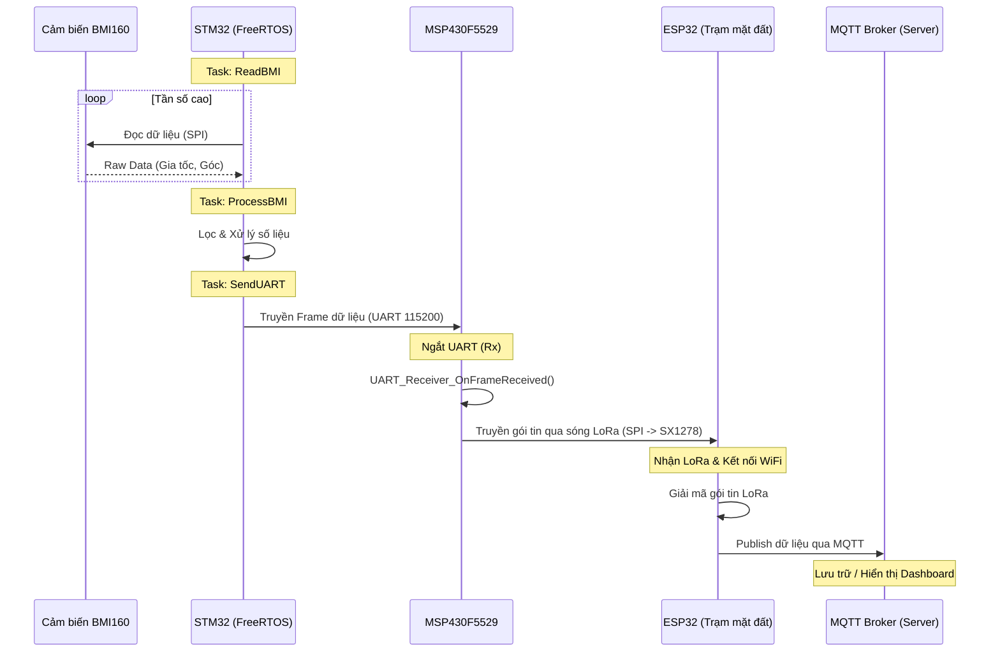

# Flight Black Box Firmware

Dự án **Flight Black Box** là hệ thống hộp đen thu thập dữ liệu cảm biến từ thiết bị bay và truyền dữ liệu theo thời gian thực về máy chủ thông qua sóng LoRa và WiFi/MQTT.

Dự án được chia thành 3 module firmware chính, chạy trên 3 vi điều khiển khác nhau: **STM32F103**, **MSP430F5529**, và **ESP32**.

## 1. Cấu trúc tổng thể của dự án

Dự án bao gồm 3 thư mục chính tương ứng với 3 thành phần vi điều khiển:

- `stm32/`: Firmware cho STM32F103 (phát triển bằng PlatformIO/STM32 HAL + FreeRTOS). Chịu trách nhiệm đọc cảm biến quán tính BMI160, xử lý dữ liệu và gửi qua UART.
- `MSP430F5529_black_box/`: Firmware cho MSP430F5529 (phát triển bằng Code Composer Studio - CCS). Đóng vai trò là trạm trung chuyển, nhận dữ liệu UART từ STM32 và phát đi qua sóng LoRa (module SX1278).
- `esp32_slave/`: Firmware cho ESP32 (phát triển bằng ESP-IDF). Đóng vai trò là trạm mặt đất (Ground Station) hoặc Boss, nhận dữ liệu LoRa từ MSP430 và đẩy lên MQTT Broker qua kết nối WiFi.

## 2. Kiến trúc tổng thể hệ thống

Hệ thống hoạt động theo luồng truyền dữ liệu một chiều từ cảm biến trên thiết bị bay đến máy chủ theo sơ đồ kiến trúc sau:

**STM32** ──(UART)──► **MSP430F5529** ──(LoRa SX1278)──► **ESP32** ──(WiFi/MQTT)──► **MQTT Broker**

### Chi tiết các khối:
- **STM32F103C8T6**: 
  - Giao tiếp SPI với cảm biến BMI160.
  - Sử dụng FreeRTOS với 3 task: `ReadBMI`, `ProcessBMI`, `SendUART`.
  - Đẩy dữ liệu ra ngoài qua UART (115200 baud).
- **MSP430F5529**:
  - Vi điều khiển lõi của hộp đen.
  - Nhận dữ liệu UART bằng ngắt (Interrupt).
  - Chuyển tiếp ngay lập tức frame dữ liệu nhận được qua giao tiếp SPI tới module LoRa SX1278 (tần số 433MHz).
- **ESP32**:
  - Nhận tín hiệu LoRa từ module SX1278.
  - Kết nối WiFi và hoạt động như một MQTT Client để publish dữ liệu tới Broker để giám sát hoặc lưu trữ.

## 3. Sơ đồ luồng hoạt động dự án

Dưới đây là sơ đồ luồng hoạt động (Data Flow) chi tiết của toàn bộ hệ thống:

